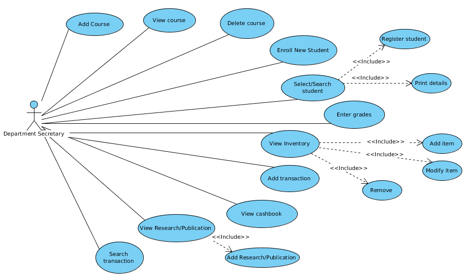

# DepInfosys
Project for CS29006 Software Lab, Summer 2016.

This project satisfies the need for a University Department Information System,  where the Department Secretary is responsible for handling the academics,  maintaining  cash logs,  and should be able to support querying for transactions.

Refer to the report and TestResults [here](TestResult_grp58_14CS30011_14CS30017.pdf).

## Screenshots

Following is a brief explanation of the use case using screenshots. A lot more screenshots can be found in `images` folder.

### Login

### New course

### Remove course

### New student enrolled

### Enroll student in a course

### Evaluate student grades for each course

### Print student records

#### Sample record

### Add items in inventory

### Modify existing items

### Add research / publications

### Search among research / publications

### Manage treasury / expenses

### Search among items / research / publications / expenses

## Demo
Below is a demo of the working in Linux.

## Members
* Surya Midatala @ [kingofools](https://github.com/kingofools)
* Kaustubh Hiware @ [kaustubhhiware](https://github.com/kaustubhhiware)
